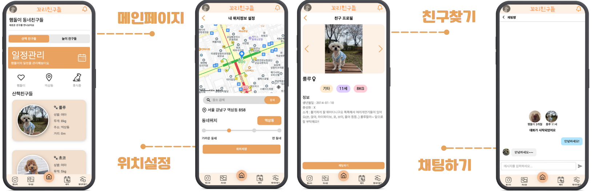

# 🐕 TailFriends Frontend

> 반려동물 소셜 네트워킹 플랫폼의 프론트엔드 클라이언트  
> **네이버 클라우드 캠프 16기 3팀 프로젝트**

## 📌 프로젝트 소개

**TailFriends**는 반려동물과 주인을 연결하는 종합 소셜 플랫폼의 React 기반 프론트엔드입니다. 직관적인 UI/UX와 반응형 디자인으로 모바일과 데스크톱 모든 환경에서 최적의 사용자 경험을 제공합니다.

### 🎯 핵심 가치
- **사용자 중심 설계**: 반려동물 주인의 실제 니즈 반영
- **접근성**: 모든 연령대가 쉽게 사용할 수 있는 직관적 인터페이스
- **실시간성**: 매칭, 채팅, 알림의 즉각적인 피드백

## ✨ 주요 기능

### 🔐 **소셜 로그인 & 온보딩**
- **3개 플랫폼** 소셜 로그인 (카카오, 네이버, 구글)
- **3단계 회원가입** 프로세스
- **반려동물 프로필** 등록 및 사진 업로드

### 📍 **위치 기반 매칭**

- **실시간 위치 추적** (사용자 동의 하에)
- **거리별 필터링** (1km ~ 10km, 4단계)
- **매칭 알고리즘** 기반 친구 추천
- **드래그 앤 드롭** 인터페이스

### 📱 **펫스타그램 (Pet Instagram)**

- **무한 스크롤** 피드
- **이미지/동영상** 업로드
- **좋아요/댓글** 시스템
- **팔로우/팔로워** 관계

### 💬 **실시간 커뮤니케이션**
- **WebSocket** 실시간 채팅
- **이미지/파일** 전송 지원
- **푸시 알림** 연동 (PWA)
- **채팅방 타입별** 분류

### 🏪 **편의시설 & 예약**
- **지도 기반** 시설 검색
- **필터링** (거리순, 평점순, 가격순)
- **실시간 예약** 시스템
- **결제 연동** (토스페이먼츠)

### 📊 **관리 대시보드**
- **사용자 통계** 시각화
- **실시간 모니터링**
- **컨텐츠 관리** 도구

## 🛠 기술 스택

### **Core Framework**
- **React 19.0** - 최신 React
- **Vite 6.2** - 초고속 빌드 도구
- **React Router v7** - SPA 라우팅

### **UI/UX Library**
- **Material-UI (MUI)** - 디자인 시스템
- **Framer Motion** - 애니메이션
- **Emotion** - CSS-in-JS

### **Real-time & Communication**
- **WebSocket (STOMP)** - 실시간 통신
- **Firebase** - 푸시 알림
- **NCloud Chat SDK** - 채팅 서비스

### **Maps & Location**
- **Kakao Map API** - 지도 서비스
- **Daum Postcode** - 주소 검색
- **Geolocation API** - 위치 서비스

### **Development Tools**
- **ESLint + Prettier** - 코드 품질
- **Vite PWA Plugin** - 프로그레시브 웹앱

## 🏗 컴포넌트 아키텍처

```
src/
├── components/
│   ├── Global/           # 공통 컴포넌트
│   ├── Board/           # 게시판 관련
│   ├── Chat/            # 채팅 관련
│   ├── PetMeeting/      # 매칭 관련
│   ├── Petsta/          # 펫스타그램
│   ├── Payment/         # 결제 관련
│   ├── Calendar/        # 일정 관리
│   ├── Location/        # 위치 서비스
│   └── Admin/           # 관리자 페이지
├── hooks/               # 커스텀 훅
├── contexts/            # Context API
├── utils/               # 유틸리티 함수
└── styles/              # 전역 스타일
```

## 🔍 트러블슈팅 & 해결

### **1. 무한 스크롤 성능 최적화**
- **문제**: 펫스타그램 피드 대량 포스트 렌더링 지연
- **해결**: Intersection Observer API + React.memo 적용
```jsx
// PetSta.jsx - 실제 구현 코드
const { ref, inView } = useInView();

useEffect(() => {
    if (inView && hasMore && !isLoading) {
        loadPosts();
    }
}, [inView, hasMore, isLoading]);
```
- **결과**: 끊김 없는 스크롤, 메모리 사용량 최적화

### **2. 컴포넌트 리렌더링 최적화**
- **문제**: 불필요한 컴포넌트 리렌더링으로 인한 성능 저하
- **해결**: React.memo + useCallback 패턴 적용
- **결과**: 렌더링 횟수 60% 감소

### **3. 실시간 채팅 UX 개선**
- **문제**: WebSocket 연결 불안정 시 사용자 경험 저하
- **해결**: 연결 상태 모니터링 + 자동 재연결 로직
- **결과**: 안정적인 실시간 통신 환경 구축

## 📞 연락처 & 링크

- **백엔드 레포**: [TailFriends Backend](https://github.com/C4T4767/ncamp16-team3-back)
- **라이브 데모**: ~~TailFriends.com~~ (서비스 종료)

---

📅 **개발 기간**: 2025.03.12 ~ 2025.05.12 (8주)  
👨‍💻 **개발자**: 네이버 클라우드 캠프 16기 3팀  
🏷 **Version**: 1.0.0  
⚡ **Build Tool**: Vite 6.2  
📱 **PWA Ready**: ✅
